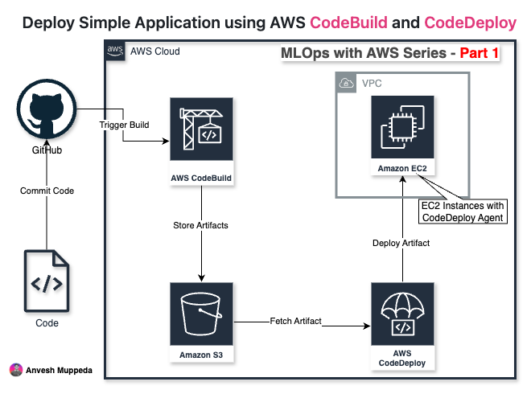
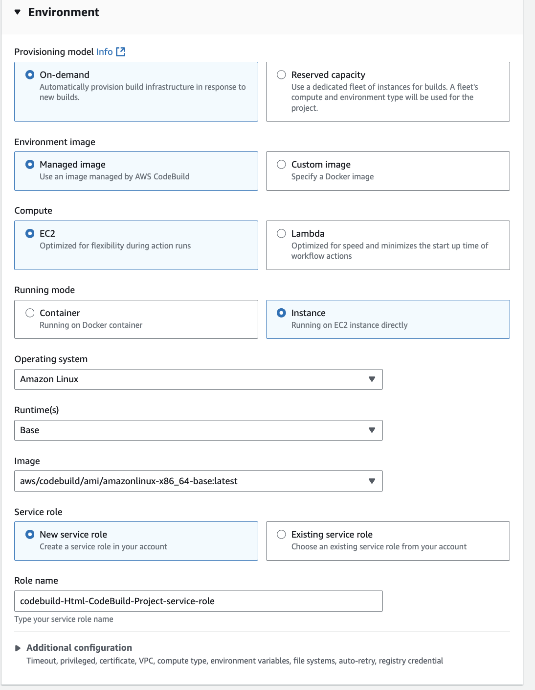
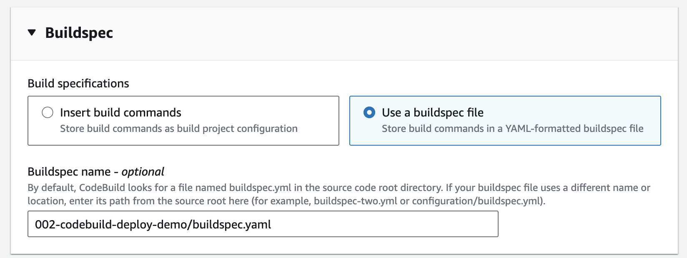
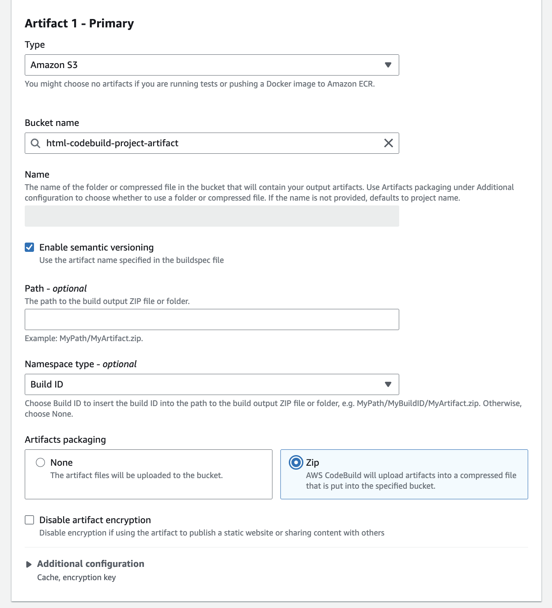
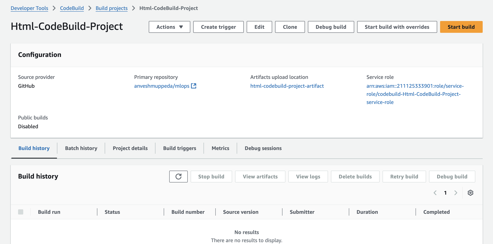
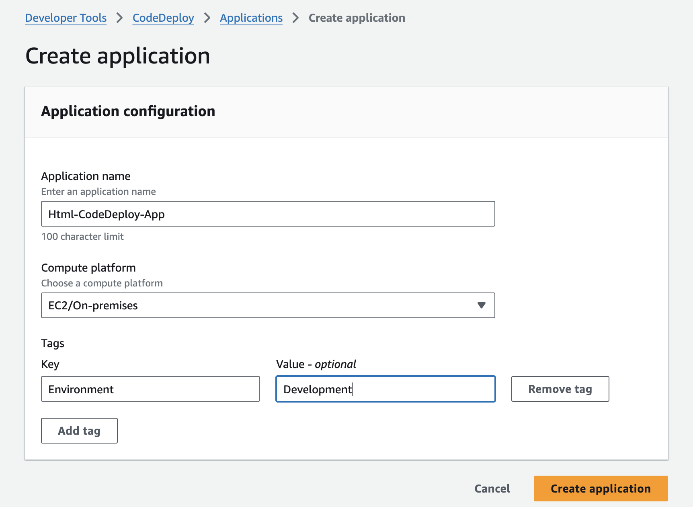
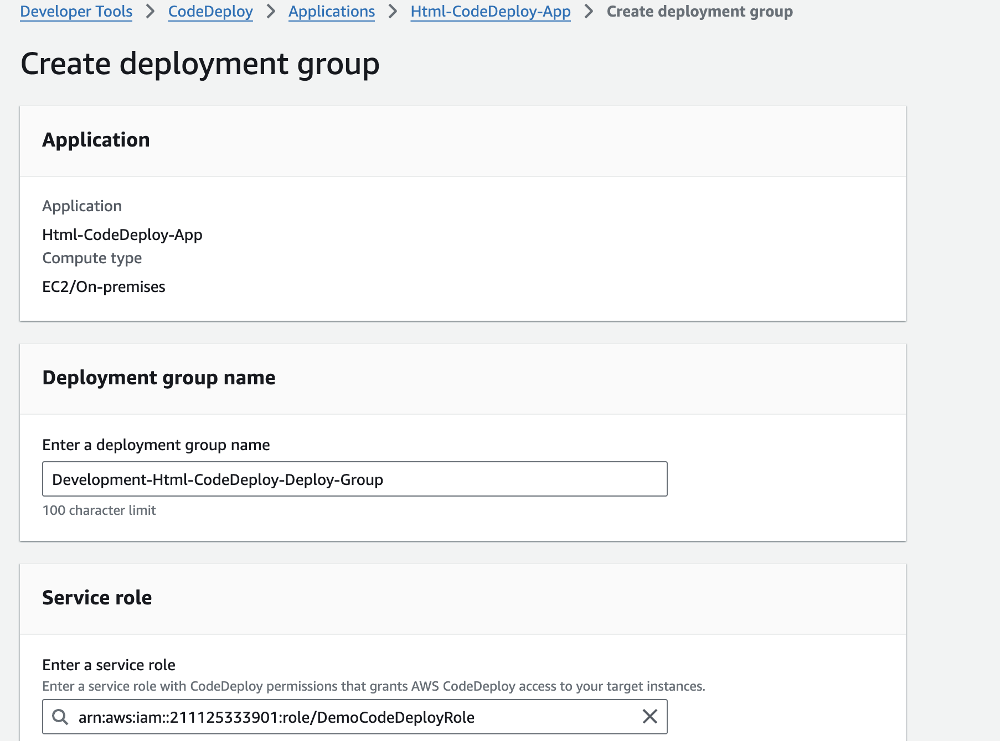
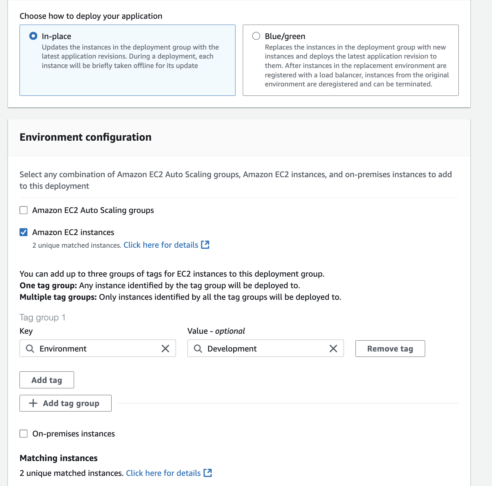
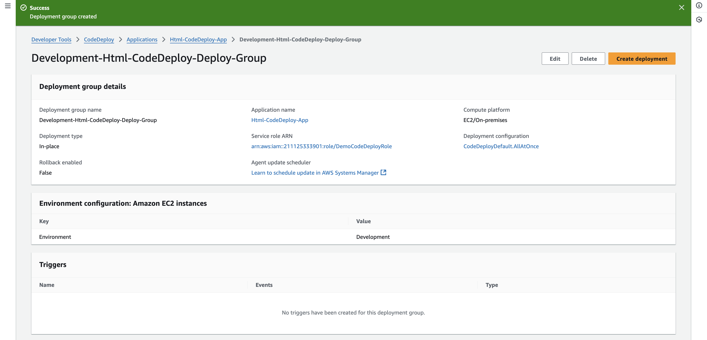
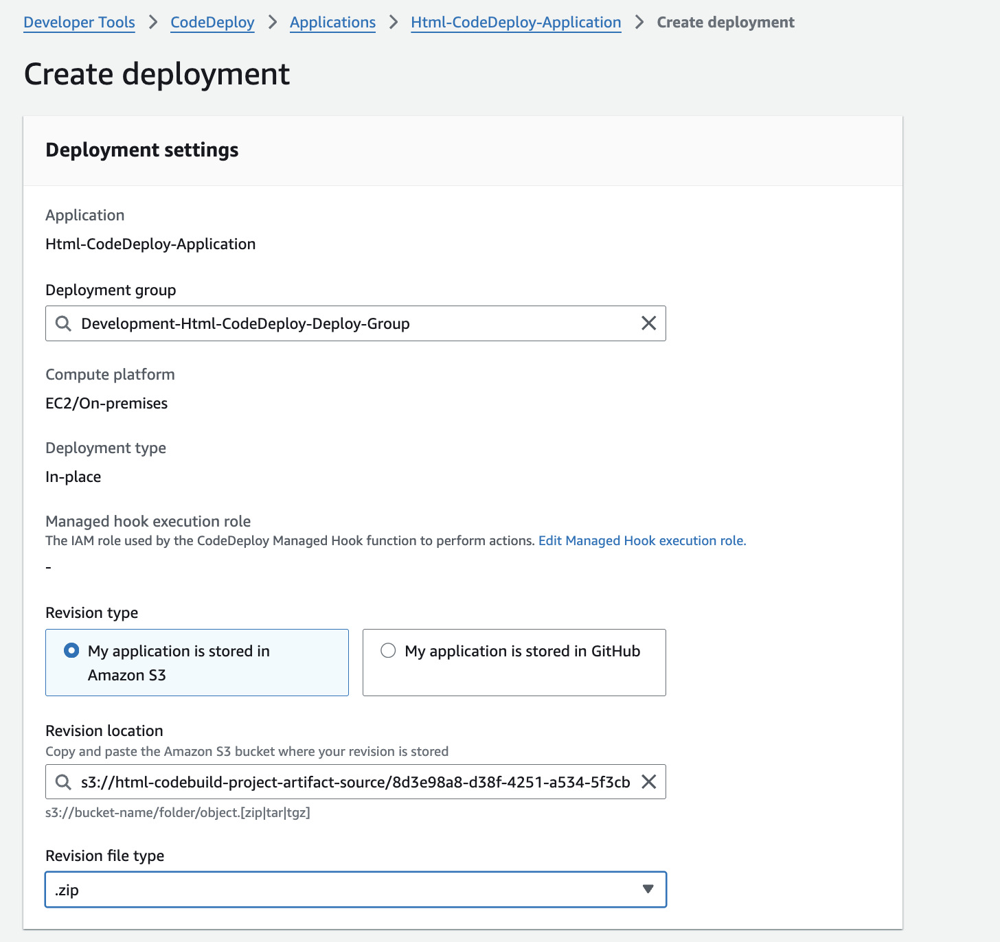

# Deploy Simple HTML Application using AWS CodeBuild and CodeDeploy

This example demonstrates how to deploy a simple HTML application using AWS CodeBuild and CodeDeploy with proper configuration and troubleshooting solutions.

. 

## Prerequisites
- AWS account with necessary permissions to create CodeBuild, CodeDeploy, S3, EC2, and CloudFormation resources
- AWS CLI installed and configured with your credentials
- Basic understanding of AWS CodeBuild, CodeDeploy, and S3
- Clone this repository to your local machine:
    ```bash
    git clone https://github.com/anveshmuppeda/mlops.git
    ```
- Navigate to the `002-codebuild-deploy-demo` directory:
    ```bash
    cd 002-codebuild-deploy-demo
    ```

## Project Structure
```
mlops/002-codebuild-deploy-demo/
├── README.md
├── app/
│   └── index.html
├── appspec.yml
├── buildspec.yaml
├── infra/
│   ├── appservers-tmp.yaml
│   ├── destroy-cft.sh
│   └── launch-cft.sh
└── scripts/
    ├── after_install.sh
    ├── install_dependencies.sh
    ├── start_server.sh
    ├── stop_server.sh
    └── validate_service.sh
```

## Step 1: Prepare Configuration Files

### 1.1 Update buildspec.yaml
Ensure your `buildspec.yaml` is configured to build only the project directory:

```yaml
version: 0.2

phases: 
    install:
        runtime-versions:
            nodejs: 12
        commands:
            - echo "This is the start of Install phase"
            - echo "Installing Node.js version 12"
            - echo "Node.js installation is complete"
    pre_build:
        commands: 
            - echo "This is the start of Pre-Build phase"
            - echo "Pre-Build phase is now completed"
    build:
        commands:
            - echo "This is the start of Build phase"
            - echo "Building the application"
            - cd 002-codebuild-deploy-demo
            - chmod +x scripts/*.sh
            - echo "Build phase is now completed"
    post_build:
        commands:
            - echo "We are currently on post_build phase"
            - echo "Post-Build phase is now completed"

artifacts:
    base-directory: 002-codebuild-deploy-demo
    files:
        - '**/*'
```

### 1.2 Update appspec.yml
Ensure your `appspec.yml` uses correct relative paths:

```yaml
version: 0.0
os: linux
files:
  - source: app/index.html
    destination: /var/www/html/
hooks:
  ApplicationStop:
    - location: scripts/stop_server.sh
      timeout: 300
      runas: root

  BeforeInstall:
    - location: scripts/install_dependencies.sh
      timeout: 300
      runas: root

  AfterInstall:
    - location: scripts/after_install.sh
      timeout: 300
      runas: root

  ApplicationStart:
    - location: scripts/start_server.sh
      timeout: 300
      runas: root

  ValidateService:
    - location: scripts/validate_service.sh
      timeout: 300
```

### 1.3 Verify Script Permissions
Make sure all scripts in the `scripts/` directory have execute permissions:
```bash
chmod +x scripts/*.sh
```

## Step 2: Create S3 Bucket for Artifacts
1. Go to the [AWS S3 console](https://s3.console.aws.amazon.com/)
2. Click **Create bucket**
3. Enter a unique bucket name (e.g., `your-codebuild-artifacts-bucket`)
4. Choose your preferred region
5. Leave other settings as default and click **Create bucket**

## Step 3: Create IAM Roles

### 3.1 CodeBuild Service Role
1. Go to [IAM Console](https://console.aws.amazon.com/iam/)
2. Click **Roles** → **Create role**
3. Select **AWS service** → **CodeBuild**
4. Attach policies:
   - `AmazonS3FullAccess` (or create a custom policy for your S3 bucket)
   - `CloudWatchLogsFullAccess`
5. Name the role (e.g., `CodeBuildServiceRole`)

### 3.2 CodeDeploy Service Role
1. Create another role for CodeDeploy
2. Select **AWS service** → **CodeDeploy**
3. Attach policy: `AWSCodeDeployRole`
4. Name the role (e.g., `CodeDeployServiceRole`)

### 3.3 EC2 Instance Profile Role
1. Create a role for EC2 instances
2. Select **AWS service** → **EC2**
3. Attach policies:
   - `AmazonS3ReadOnlyAccess` (or custom policy for your artifact bucket)
   - `AmazonSSMManagedInstanceCore` (for Systems Manager)
4. Name the role (e.g., `EC2CodeDeployRole`)

## Step 4: Deploy Infrastructure using CloudFormation
1. Navigate to the infra directory:
   ```bash
   cd 002-codebuild-deploy-demo/infra
   ```
2. Review and update the CloudFormation template (`appservers-tmp.yaml`) to ensure:
   - EC2 instances have the correct IAM role attached
   - Security groups allow HTTP/HTTPS traffic
   - User data includes CodeDeploy agent installation
3. Run the launch script:
   ```bash
   ./launch-cft.sh
   ```

### 4.1 Verify CodeDeploy Agent Installation
After EC2 instances are created, SSH into them and verify the CodeDeploy agent:
```bash
# Check if agent is running
sudo service codedeploy-agent status

# If not running, start it
sudo service codedeploy-agent start

# Enable it to start on boot
sudo service codedeploy-agent enable
```

## Step 5: Create CodeBuild Project
1. Go to the [AWS CodeBuild console](https://console.aws.amazon.com/codesuite/codebuild/projects)
2. Click **Create build project**
3. Configure:
   - **Project name**: `Html-CodeBuild-Project`
   )
   - **Source provider**: GitHub/CodeCommit
   
   - **Repository**: Select your repository
   - **Environment**:
     - Environment image: Managed image
     - Compute: EC2
     - Operating system: Amazon Linux
     - Runtime: Standard
     - Service role: Use the role created in Step 3.1
     
   - **Buildspec**: Use a buildspec file (buildspec.yaml in your repo)
     
   - **Artifacts**:
     - Type: Amazon S3
     - Bucket name: The bucket created in Step 2
     - Path: `builds/` (optional)
     - Packaging: Zip
    
4. Click **Create build project**


## Step 6: Create CodeDeploy Application
1. Go to the [AWS CodeDeploy console](https://console.aws.amazon.com/codesuite/codedeploy/applications)
2. Click **Create application**
3. Configure:
   - **Application name**: `Html-CodeDeploy-Application`
   - **Compute platform**: EC2/On-premises
4. Click **Create application**
. 

## Step 7: Create CodeDeploy Deployment Group
1. In your CodeDeploy application, click **Create deployment group**
2. Configure:
   - **Deployment group name**: `Development-Html-CodeDeploy-Deploy-Group`
   - **Service role**: Use the role created in Step 3.2
   - **Deployment type**: In-place
   - **Environment configuration**: Amazon EC2 instances
   - **Tag filters**: Add tags that match your EC2 instances (e.g., `Environment: Development`)
   - **Deployment settings**: `CodeDeployDefault.OneAtATime`
   - **Load balancer**: Disable (unless using one)


3. Click **Create deployment group**


## Step 8: Test the Build Process
1. Go to your CodeBuild project
2. Click **Start build**
3. Monitor the build logs for any errors
4. Verify that the build artifact is uploaded to your S3 bucket
5. Check that the artifact contains only the files from `002-codebuild-deploy-demo/`

## Step 9: Create CodeDeploy Deployment
1. Go to your CodeDeploy application
2. Click **Create deployment**
3. Configure:
   - **Deployment group**: Select the group created in Step 7
   - **Revision type**: My application is stored in Amazon S3
   - **Revision location**: `s3://your-bucket-name/builds/build-artifact.zip`
   - **Revision file type**: .zip
4. Click **Create deployment**


## Step 10: Monitor and Verify Deployment
1. Monitor the deployment progress in the CodeDeploy console
2. Check deployment logs for any errors
3. SSH into your EC2 instances and verify:
   ```bash
   # Check if files are deployed
   ls -la /var/www/html/
   
   # Check if web server is running
   sudo systemctl status httpd  # or nginx
   ```
4. Test the application by accessing the public IP of your EC2 instance in a browser


## Troubleshooting Common Issues

### Issue 1: "UnknownError - CodeDeploy agent was not able to receive the lifecycle event"
**Solution**: 
- Ensure CodeDeploy agent is installed and running on EC2 instances
- Check IAM permissions for EC2 instances
- Verify security group allows outbound HTTPS traffic

### Issue 2: "File not found" errors in deployment
**Solution**:
- Check that `appspec.yml` paths are relative to artifact root
- Verify `buildspec.yaml` uses correct `base-directory`
- Ensure scripts have execute permissions

### Issue 3: Script execution failures
**Solution**:
- Check script syntax and permissions
- Review CodeDeploy agent logs: `/var/log/aws/codedeploy-agent/codedeploy-agent.log`
- Verify script dependencies are installed

### Issue 4: Entire repository being built instead of project folder
**Solution**:
- Use `base-directory` in buildspec.yaml artifacts section
- Ensure buildspec.yaml changes to the correct directory during build

## Step 11: Clean Up Resources
To clean up all resources created during this demo:

1. Delete CodeDeploy deployments and applications
2. Delete CodeBuild projects
3. Run the cleanup script:
   ```bash
   cd 002-codebuild-deploy-demo/infra
   ./destroy-cft.sh
   ```
4. Delete the S3 bucket and its contents
5. Remove IAM roles if not needed elsewhere

## Best Practices
1. Use least privilege IAM policies
2. Tag all resources for better organization
3. Monitor deployments using CloudWatch
4. Test deployments in a staging environment first
5. Keep deployment scripts simple and idempotent
6. Use Blue/Green deployments for production workloads

## Additional Resources
- [AWS CodeBuild Documentation](https://docs.aws.amazon.com/codebuild/)
- [AWS CodeDeploy Documentation](https://docs.aws.amazon.com/codedeploy/)
- [CodeDeploy Agent Installation Guide](https://docs.aws.amazon.com/codedeploy/latest/userguide/codedeploy-agent-operations-install.html)