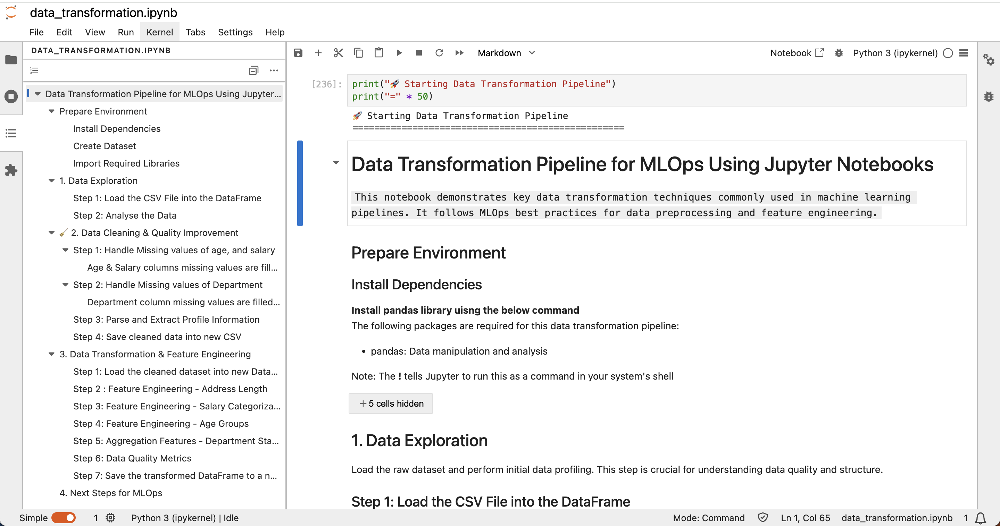

# Data Transformation Pipeline for MLOps Using Jupyter Notebooks
*A hands-on guide to building a data transformation workflow using Python, Pandas, and best practices in MLOps.*



## 🎯 Overview

This module implements a comprehensive data transformation pipeline designed for machine learning operations (MLOps). It transforms raw data into a format suitable for training machine learning models through systematic data cleaning, normalization, and feature engineering processes.

The transformation pipeline is implemented in a Jupyter notebook ([data_transformation.ipynb](./data_transformation.ipynb)) that follows MLOps best practices for reproducibility, monitoring, and automation.

## 🛠️ Environment Setup

### Prerequisites

This module requires **Anaconda** and **Jupyter Notebook** for interactive development and execution.

### Installation Steps

#### 1. Install Anaconda
```bash
brew install anaconda
```

#### 2. Install Jupyter Notebook
```bash
brew install jupyter
```

Jupyter Notebook provides a web-based interactive computing environment perfect for data science workflows. For enhanced functionality, you can also use JupyterLab, which offers a more flexible and powerful interface.

#### 3. Create Virtual Environment
```bash
# Create a dedicated virtual environment for data transformation
python -m venv data_transformation_env

# Activate the virtual environment
source data_transformation_env/bin/activate  # On macOS/Linux
# or
data_transformation_env\Scripts\activate     # On Windows
```

#### 4. Launch Jupyter Notebook
```bash
# Start Jupyter Notebook in the virtual environment
jupyter notebook
```

This command opens Jupyter Notebook in your default web browser, providing an interactive interface for code development and execution.

## 📓 Creating the Notebook

1. **Create New Notebook**: Click the "New" button and select "Python 3" (or your installed Python version)
2. **Rename Notebook**: Change the default name from `Untitled.ipynb` to `data_transformation.ipynb`
   - Method 1: Click on the notebook name at the top of the page
   - Method 2: Navigate to `File` → `Rename` and enter the new name

## 🔄 Pipeline Architecture

The data transformation pipeline consists of four main phases. **Follow the [data_transformation.ipynb](data_transformation.ipynb) notebook to implement all these steps:**

### 📦 1. Environment Preparation
**Implementation**: See Section 1 in [data_transformation.ipynb](data_transformation.ipynb)
- **1.1 Install Dependencies**: Set up required Python packages
- **1.2 Create Dataset**: Generate or load the source dataset
- **1.3 Import Libraries**: Load necessary Python libraries for data processing

### 🔍 2. Data Exploration & Profiling
**Implementation**: See Section 2 in [data_transformation.ipynb](data_transformation.ipynb)
- **2.1 Data Loading**: Load CSV data into pandas DataFrame
- **2.2 Data Analysis**: Comprehensive data profiling and quality assessment
  - Dataset shape and structure analysis
  - Data types and memory usage assessment
  - Missing value pattern identification
  - Statistical distribution analysis
  - Duplicate detection and handling

### 🧹 3. Data Cleaning & Quality Improvement
**Implementation**: See Section 3 in [data_transformation.ipynb](data_transformation.ipynb)
- **3.1 Numeric Data Cleaning**: Handle missing values in age and salary columns
  - Strategy: Median imputation for robustness against outliers
  - Documentation of imputation methods for reproducibility
  
- **3.2 Categorical Data Cleaning**: Handle missing department values
  - Strategy: Fill with 'Unknown' category to preserve missing information
  
- **3.3 Profile Data Extraction**: Parse JSON profile information
  - Extract address, phone, and email into separate columns
  - Implement safe JSON parsing with error handling
  
- **3.4 Data Validation**: Perform quality checks and validation
  - Outlier detection in numeric columns
  - Email format validation
  - Data range validation

### 🔄 4. Feature Engineering & Transformation
**Implementation**: See Section 4 in [data_transformation.ipynb](data_transformation.ipynb)
- **4.1 Address Length Feature**: Calculate address length for geographic analysis
- **4.2 Salary Categorization**: Convert continuous salary into ordinal categories
- **4.3 Age Group Creation**: Demographic segmentation based on age ranges
- **4.4 Email Domain Extraction**: Extract domains for company/provider analysis
- **4.5 Department Statistics**: Aggregate department-level insights
- **4.6 Data Scaling**: Create normalized versions of numeric features
- **4.7 Quality Metrics**: Calculate data quality indicators for monitoring

## 📊 Feature Engineering Details

### Salary Categories
- **Low**: $0 - $40,000
- **Medium**: $40,001 - $60,000
- **High**: $60,001 - $80,000
- **Very High**: $80,001+

### Age Groups
- **Young**: 16-25 years
- **Early Career**: 26-35 years
- **Mid Career**: 36-45 years
- **Senior**: 46-55 years
- **Experienced**: 56+ years

### Scaling Methods
- **Min-Max Scaling**: Normalize features to 0-1 range
- **Z-Score Normalization**: Standardize features to mean=0, std=1

## 📁 Output Files

The pipeline generates several output files for different use cases. **All file generation steps are detailed in the [data_transformation.ipynb](data_transformation.ipynb) notebook:**

1. **`cleaned_data.csv`**: Data after cleaning and quality improvements
2. **`transformed_data.csv`**: Final dataset with all engineered features
3. **`department_statistics.csv`**: Aggregated department-level insights

## 🚀 MLOps Integration

### Monitoring & Tracking
- **Data Quality Metrics**: Track data health over time
- **Transformation Metadata**: Document all pipeline parameters
- **Version Control**: Maintain reproducible transformation history

### Next Steps
1. **Model Training**: Use transformed features for ML model development
2. **Model Validation**: Implement cross-validation and testing strategies
3. **Model Deployment**: Deploy trained models to production
4. **Data Drift Monitoring**: Monitor for changes in data distribution
5. **Pipeline Automation**: Implement automated pipeline orchestration

## 📚 Additional Resources

### Documentation & Guides
- [Data Transformation Guide](./data_transformation.md) - Detailed implementation guide

### Installation References
- [Anaconda Installation Guide](https://docs.anaconda.com/anaconda/install/)
- [Jupyter Notebook Documentation](https://jupyter.org/install)
- [JupyterLab Installation](https://jupyterlab.readthedocs.io/en/stable/getting_started/installation.html)

### Technical References
- [Pandas Documentation](https://pandas.pydata.org/pandas-docs/stable/)
- [Python Virtual Environments](https://docs.python.org/3/tutorial/venv.html)
- [Data Cleaning with Pandas](https://realpython.com/python-data-cleaning-numpy-pandas/)
---

## 💡 Pro Tips

1. **Environment Isolation**: Always use virtual environments for reproducible results
2. **Version Control**: Track all notebook changes in Git for collaboration
3. **Documentation**: Document all transformation decisions for team understanding
4. **Testing**: Validate transformations with sample data before full pipeline runs
5. **Monitoring**: Implement data quality checks for production pipelines

This comprehensive guide ensures your data transformation pipeline follows *some of the* MLOps best practices. 
