# Data Transformation using Amazon SageMaker Data Wrangler

This guide demonstrates how to perform data transformation using **Amazon SageMaker Data Wrangler**, following similar steps to the [previous module](./../003-data-transformation/data_transformation.ipynb), but using the Data Wrangler UI instead of Jupyter notebooks.

## ✅ Prerequisites
- AWS account with SageMaker access
- `mock_data.csv` (located in the `data` folder of this repo)
- An S3 bucket to store your data

## 🚀 Step-by-Step Instructions

### 1. Upload Data to S3
1. Go to the [AWS S3 Console](https://s3.console.aws.amazon.com/).
2. Choose or create a new S3 bucket.
3. Upload the `mock_data.csv` file into this bucket.
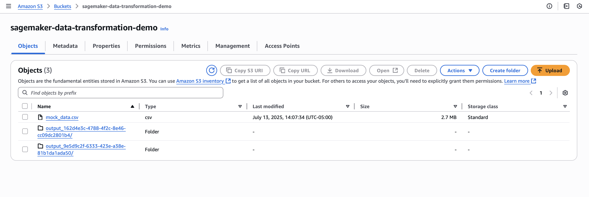

### 2. Set Up SageMaker Studio Environment
1. Go to the [AWS SageMaker Console](https://console.aws.amazon.com/sagemaker/).
2. Navigate to **"Domains"** under **Admin configurations**.
3. Click **Create Domain**, use the default settings, and click **Create**.
    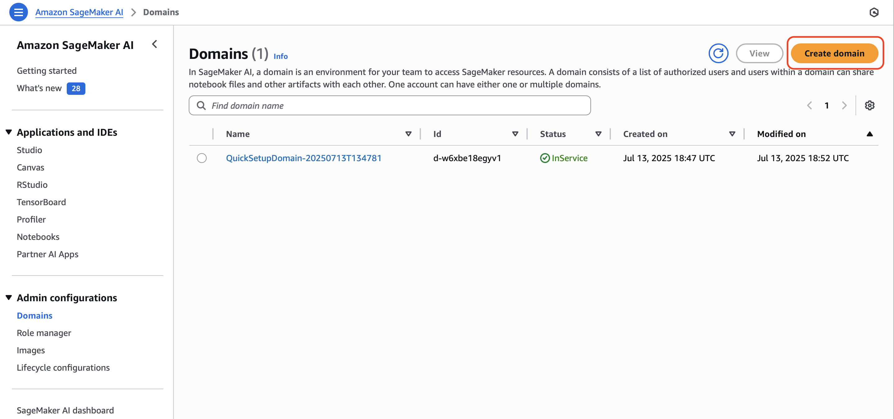
4. After the domain is created, click on the domain name.
5. Go to **User Profiles**, create a new profile (if not already created).
6. From the user profile, click **Launch app > Studio**.
   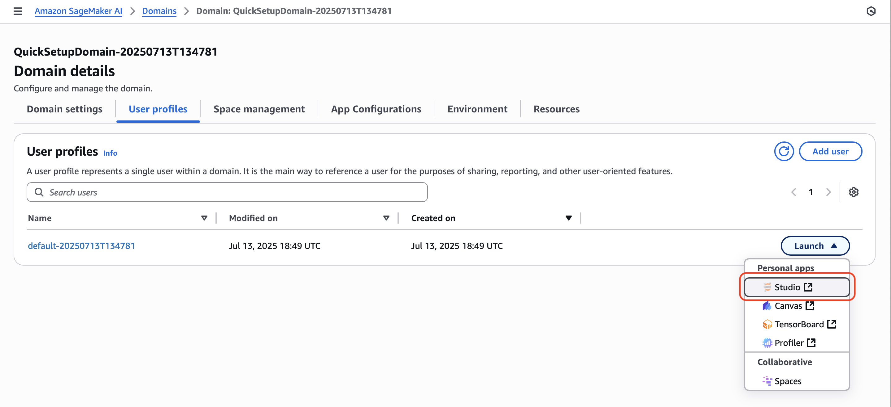
   


### 3. Open Data Wrangler
1. In SageMaker Studio, on the left sidebar, click on the **Data** icon.
2. Select the **Data Wrangler** tab.
  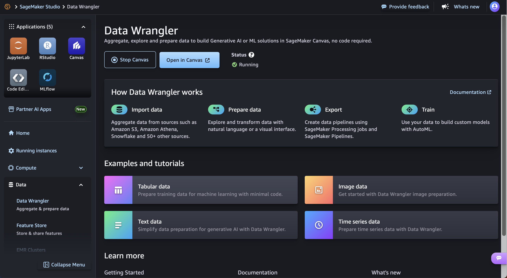
3. Click **Start Canvas**, then **Open in Canvas** to launch Data Wrangler.
  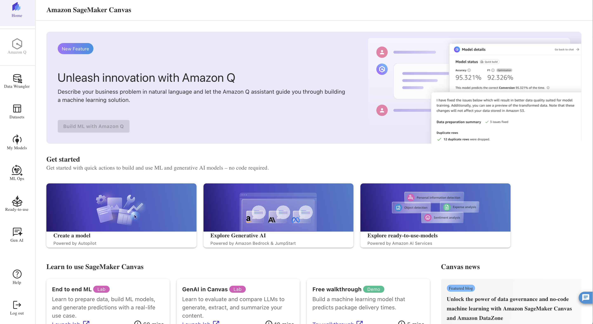

### 4. Import Dataset
1. Click **Import and prepare data**.

2. Select **Dataset type** as **Tabular**.
3. Choose **S3** as your data source.
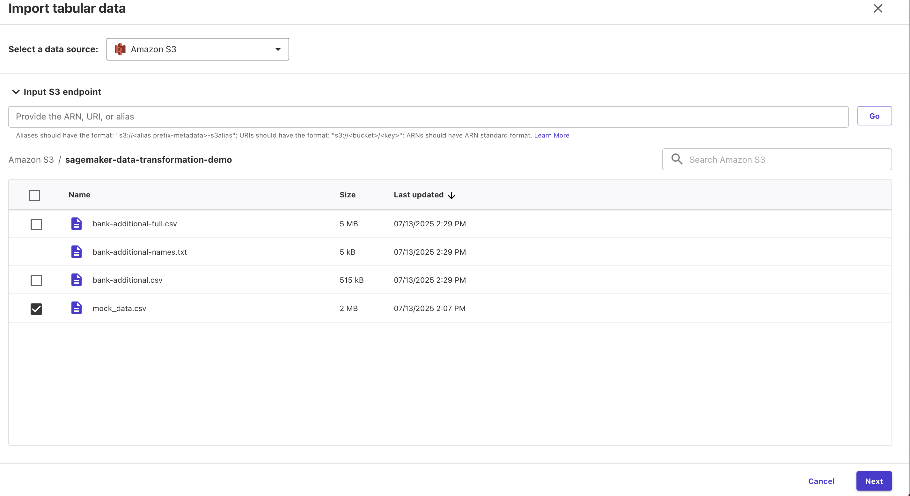
4. Locate and select the `mock_data.csv` file.
5. Click **Import** to load the dataset into Data Wrangler.
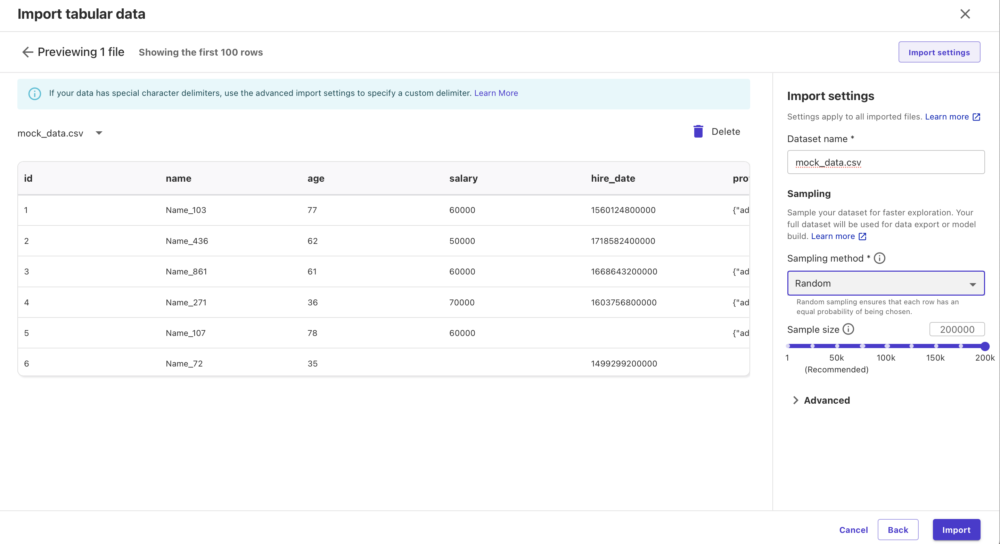
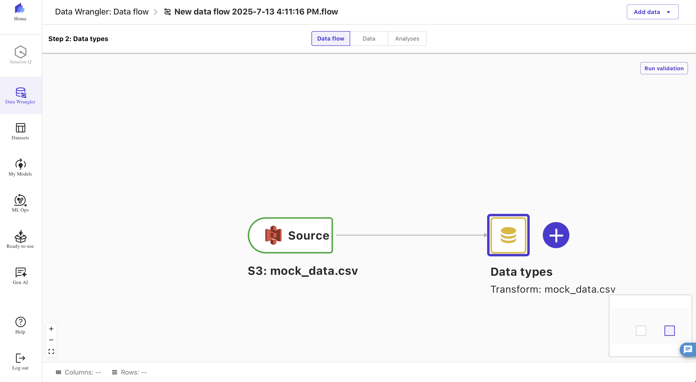
6. Rename the default flow if desired (from the top of the interface).
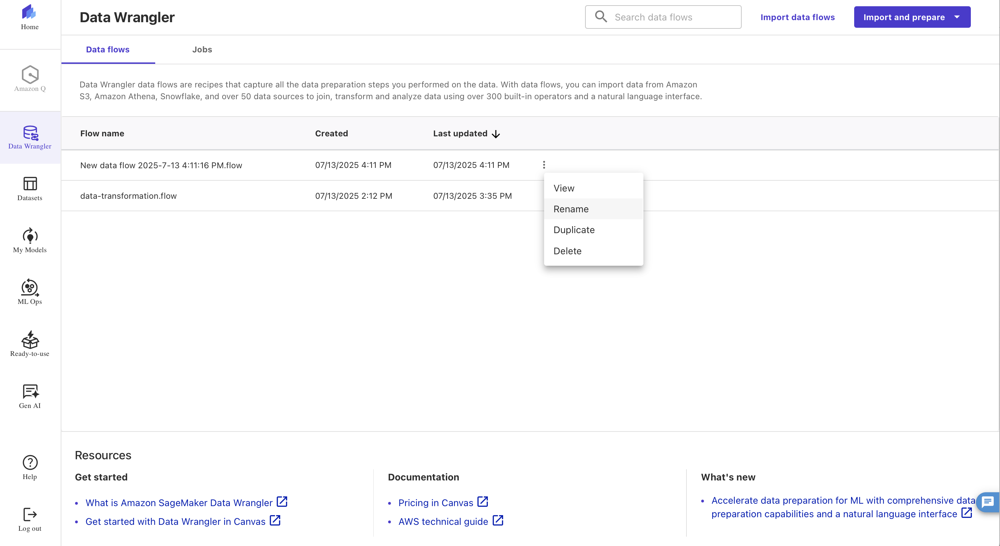

### 5. Apply Data Cleaning & Transformation
Click **Transform** and apply the following steps:


- ✅ **Remove duplicates**
  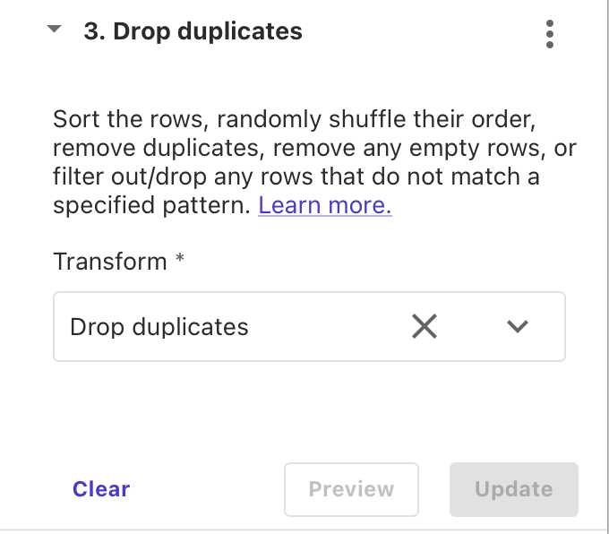
- ✅ **Handle missing values**:
  - Fill `age` with **mean**
    
  - Fill `salary` with **median**
  - Fill `department` with **"Unknown"**
    
- ✅ **Parse `profile` column** into:
  - `address`, `phone`, `email`
    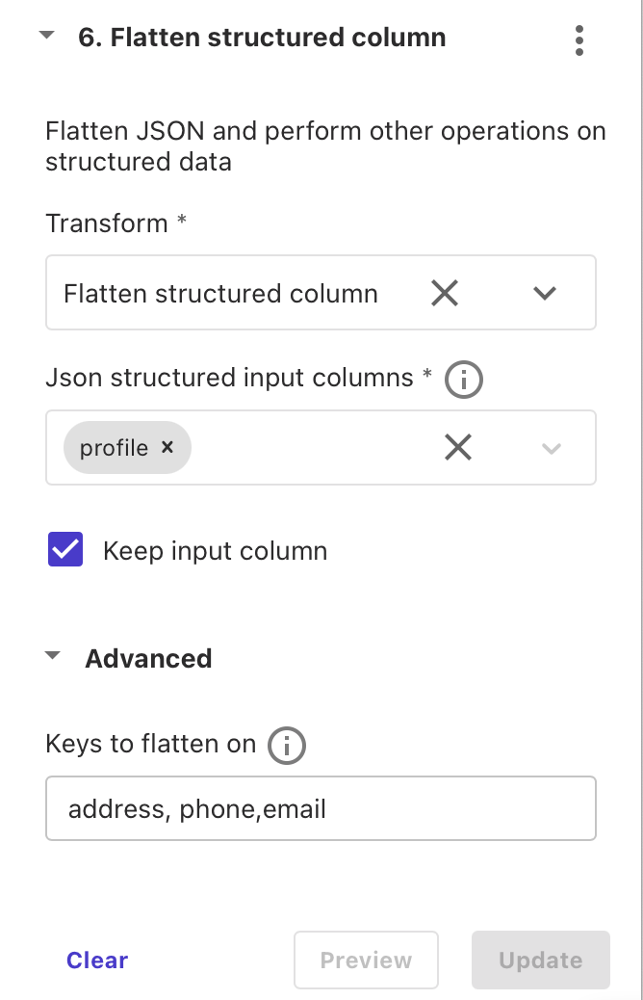
- ✅ **Rename** the extracted columns appropriately
  - Rename `profile.address` to `address`
  - Rename `profile.phone` to `phone`
  - Rename `profile.email` to `email`
    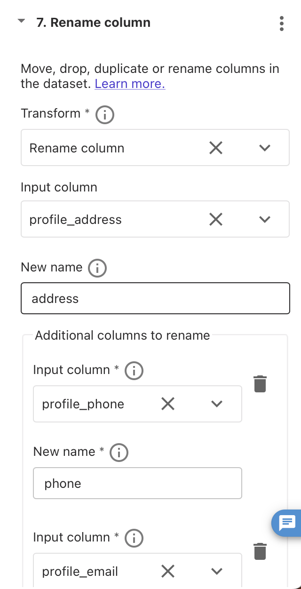
- ✅ **Drop the original `profile` column**
  

> After each transformation, click **Apply** to save the change.

### 6. Export Cleaned Dataset
1. Click **Export** from the toolbar.
  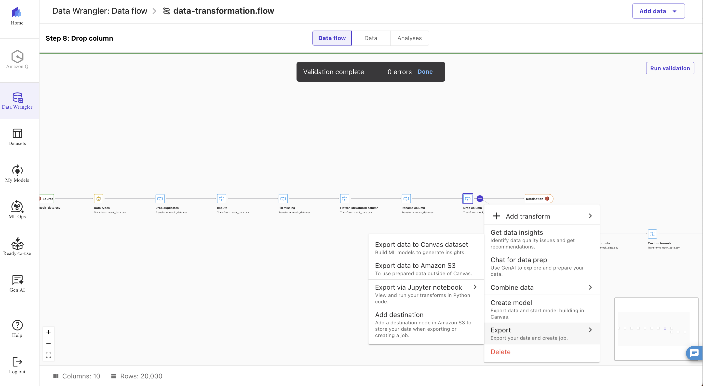
2. Select **Amazon S3** as the export destination.
3. Choose the output S3 bucket and specify a folder path.
  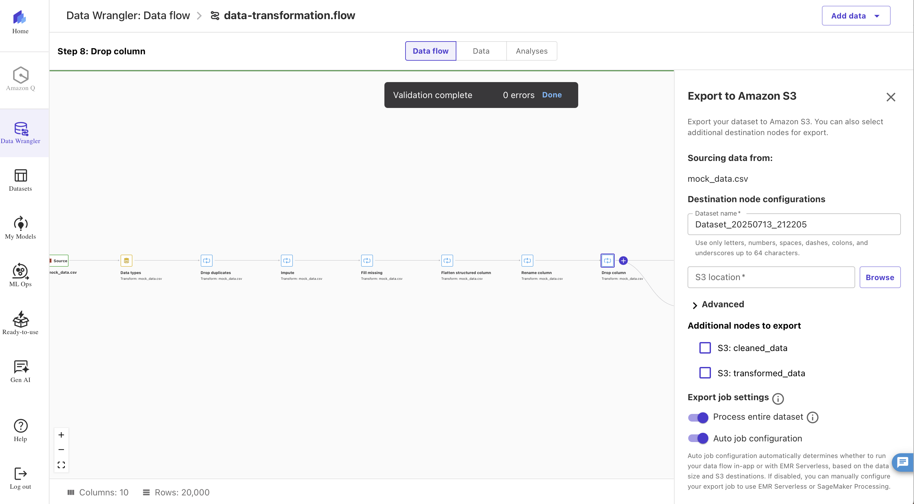
4. Click **Export**.

### 7. Feature Engineering
Use **Custom Formula Transformations** to add the following:

- ✅ **`address_length`**:
  ```sql
  IF(address IS NOT NULL, length(cast(address AS string)), 0)
  ```
  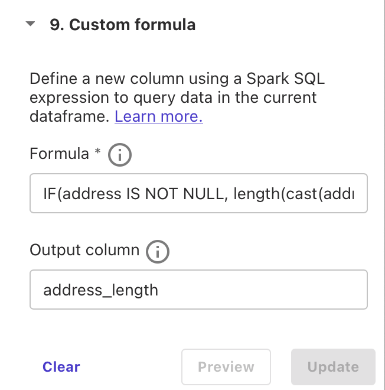
- ✅ **`salary_category`**:
  ```sql
  CASE
      WHEN salary IS NULL THEN 'unknown'
      WHEN salary <= 50000 THEN 'low'
      WHEN salary > 50000 AND salary <= 70000 THEN 'medium'
      WHEN salary > 70000 AND salary <= 100000 THEN 'high'
      ELSE 'very high'
  END
  ```
  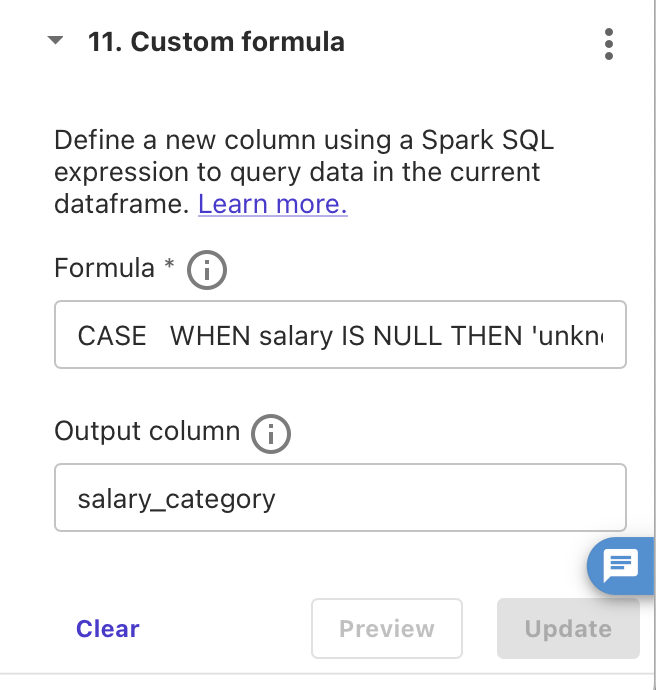

- ✅ **`age_group`**:
  ```sql
  CASE
      WHEN age IS NULL THEN 'Unknown'
      WHEN age <= 25 THEN 'Young'
      WHEN age > 25 AND age <= 35 THEN 'Early Career'
      WHEN age > 35 AND age <= 45 THEN 'Mid Career'
      WHEN age > 45 AND age <= 55 THEN 'Senior'
      ELSE 'Experienced'
  END
  ```
  

> After each formula transformation, click **Apply**.

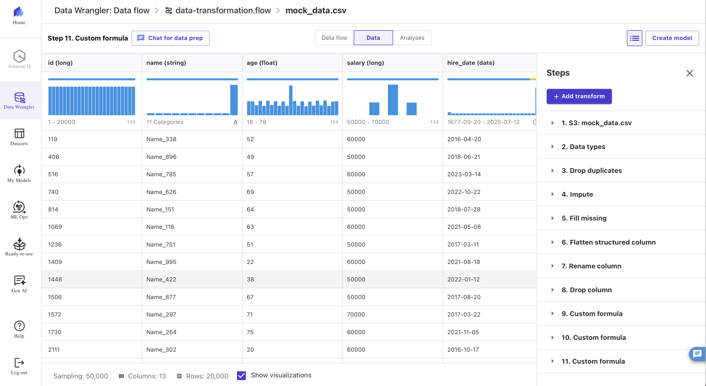

### 8. Export Final Dataset
1. Click **Export** again after feature engineering.
2. Choose the **same or a new S3 bucket**.
3. Provide an output path for the final transformed dataset.
4. Click **Export** to complete.

### 9. Final Output
- The final dataset will be available in the specified S3 bucket.
- You can access it via the S3 console or programmatically using AWS SDKs.
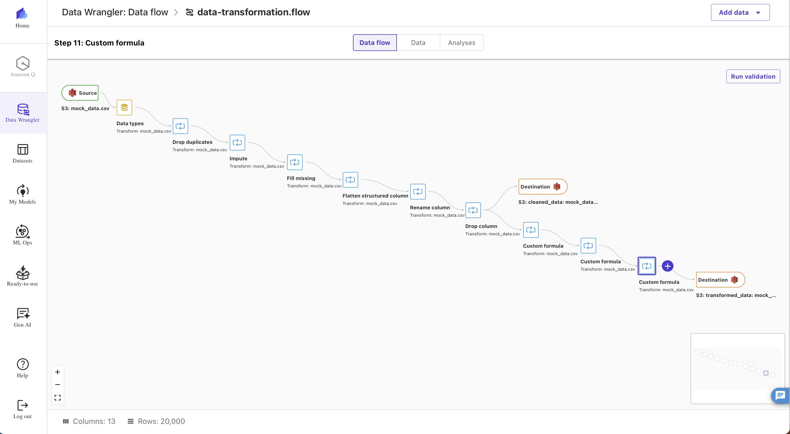

## 🧹 Cleanup Resources
To avoid unwanted charges:

1. Delete the S3 bucket (if no longer needed).
2. In SageMaker Studio, go to **Data Wrangler > Canvas** and click **Stop**.
3. Delete the SageMaker **Domain** and **User Profile** (if unused).
4. Optionally, delete the entire **SageMaker Studio** environment.

## ✅ You’re Done!
You've successfully set up Amazon SageMaker Data Wrangler, transformed your dataset, performed feature engineering, and exported your final dataset for further use in ML pipelines or analysis.
