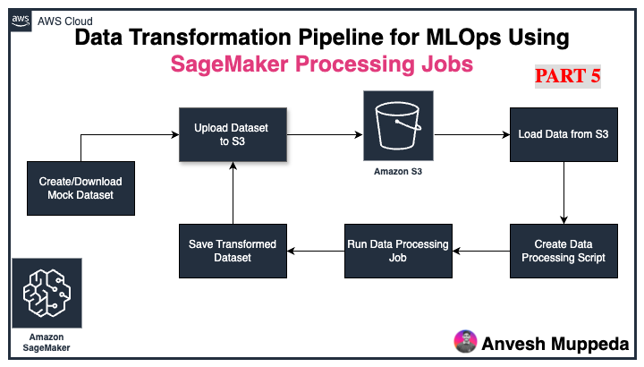
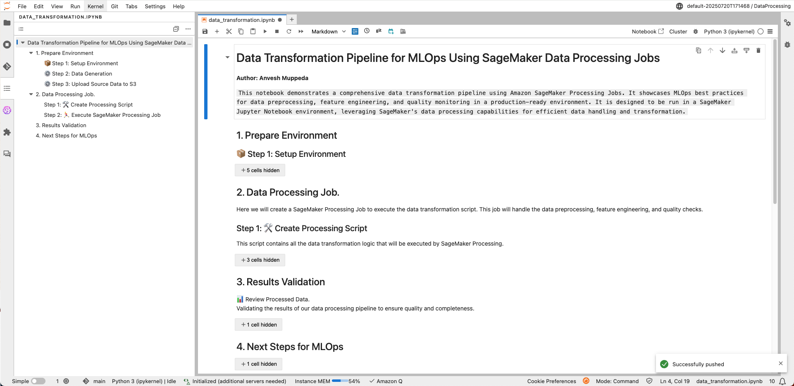
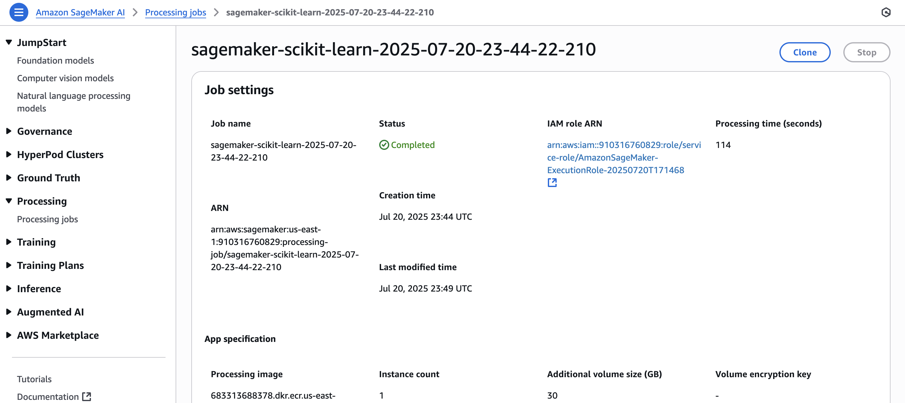

# Simple Data Processing with Amazon SageMaker Processing Jobs

*A comprehensive guide to implementing MLOps best practices for data preprocessing and feature engineering*



## Introduction

In the world of machine learning, data preprocessing often consumes 80% of a data scientist's time. As organizations scale their ML operations, the need for robust, repeatable, and scalable data transformation pipelines becomes critical. Amazon SageMaker Processing Jobs provide an elegant solution for building production-ready data transformation workflows that integrate seamlessly with your MLOps pipeline.

In this guide, I'll walk you through creating a comprehensive data transformation pipeline using SageMaker Processing Jobs, demonstrating how to handle real-world data quality challenges while maintaining MLOps best practices.



## What Are SageMaker Processing Jobs?

SageMaker Processing Jobs are fully managed compute instances that allow you to run data preprocessing, feature engineering, and model evaluation workloads at scale. They provide:

- **Scalable Infrastructure**: Automatically provision and manage compute resources
- **Cost Efficiency**: Pay only for what you use with automatic scaling
- **Integration**: Seamless connection with other SageMaker services
- **Flexibility**: Support for custom containers and frameworks

## Architecture Overview

Our data transformation pipeline follows this high-level architecture:

```
Raw Data (S3) → SageMaker Processing Job → Multiple Outputs (S3)
                            ↓
                   ┌─────────────────────┐
                   │  • Cleaned Data    │
                   │  • Transformed Data │
                   │  • Quality Metrics  │
                   │  • Dept Statistics  │
                   └─────────────────────┘
```

The pipeline handles common data challenges including:
- Missing value imputation
- JSON field extraction
- Feature engineering
- Data quality monitoring
- Statistical reporting
- Department-level analytics

## Step 1: Environment Setup

First, we establish our SageMaker environment and configure the necessary AWS resources:

```python
import sagemaker
import boto3
import pandas as pd
from sagemaker.processing import ProcessingInput, ProcessingOutput, ScriptProcessor

# Initialize SageMaker session
sagemaker_session = sagemaker.Session()
role = sagemaker.get_execution_role()
bucket = sagemaker_session.default_bucket()
region = boto3.Session().region_name
```

This setup ensures we have the proper permissions and S3 bucket configuration for our processing pipeline.

## Step 2: Data Generation and Upload

For this demonstration, we create a realistic dataset that simulates common production data challenges:

```python
# Generate mock data with intentional quality issues
data = {
    "id": np.arange(1, 20001),
    "name": [f"Name_{i}" for i in np.random.randint(1, 1000, 20000)],
    "age": np.random.randint(18, 80, 20000),
    "salary": np.random.choice([50000, 60000, 70000, None], 20000),
    "profile": [complex_json_structure() for _ in range(20000)],
    "department": np.random.choice(["HR", "IT", "Finance", None], 20000),
}
```

The dataset includes:
- **Missing values** in critical fields
- **JSON structures** requiring parsing
- **Inconsistent data types**
- **Null values** across multiple columns

We then upload this data to S3 for processing:

```python
s3.meta.client.upload_file('data/mock_data.csv', bucket, 'input/mock_data.csv')
```

## Step 3: Creating the Processing Script

The heart of our pipeline is a comprehensive processing script that handles all transformation logic:

### Data Cleaning
```python
# Handle missing values with statistical imputation
age_median = df['age'].median()
salary_median = df['salary'].median()
df['age'] = df['age'].fillna(age_median)
df['salary'] = df['salary'].fillna(salary_median)
df['department'] = df['department'].fillna('Unknown')
```

### JSON Field Extraction
```python
# Parse complex JSON structures
df['profile'] = df['profile'].apply(lambda x: json.loads(x) if pd.notnull(x) else {})
df['address'] = df['profile'].apply(lambda x: x.get('address', None))
df['phone'] = df['profile'].apply(lambda x: x.get('phone', None))
df['email'] = df['profile'].apply(lambda x: x.get('email', None))
```

### Feature Engineering
```python
# Create meaningful features for ML
df['address_length'] = df['address'].apply(lambda x: len(str(x)))

# Categorical features
salary_bins = [0, 50000, 70000, 100000]
salary_labels = ['low', 'medium', 'high']
df['salary_category'] = pd.cut(df['salary'], bins=salary_bins, labels=salary_labels)

age_bins = [0, 25, 35, 45, 55, float('inf')]
age_labels = ['Young', 'Early Career', 'Mid Career', 'Senior', 'Experienced']
df['age_group'] = pd.cut(df['age'], bins=age_bins, labels=age_labels)
```

### Quality Monitoring
```python
# Generate comprehensive quality metrics
quality_metrics = {
    'total_rows': len(df),
    'missing_values_count': df.isnull().sum().sum(),
    'duplicate_rows': df.duplicated().sum(),
    'unique_departments': df['department'].nunique(),
    'processing_timestamp': datetime.now().isoformat()
}
```

## Step 4: Executing the Processing Job

With our script ready, we configure and launch the SageMaker Processing Job:

```python
processor = ScriptProcessor(
    image_uri=sagemaker.image_uris.retrieve('sklearn', 'us-east-1', '1.2-1'),
    role=role,
    command=['python3'],
    instance_type='ml.t3.medium',
    instance_count=1
)

processor.run(
    code='preprocessing_script.py',
    inputs=[ProcessingInput(
        source=f"s3://{bucket}/input/mock_data.csv",
        destination='/opt/ml/processing/input'
    )],
    outputs=[ProcessingOutput(
        source='/opt/ml/processing/output',
        destination=f"s3://{bucket}/output/data-processed"
    )]
)
```



## Step 5: Results and Validation

After processing completes, we validate our results:

### Processed Data Quality
- **20,000 rows** successfully processed
- **Zero missing values** in critical fields
- **New features** ready for ML training
- **Quality metrics** tracked and stored

### Generated Outputs
1. **Cleaned Dataset**: Missing values handled, data types normalized
2. **Transformed Dataset**: New features and categorizations
3. **Department Statistics**: Business insights and analytics
4. **Quality Metrics**: Comprehensive data quality reporting

## Benefits of This Approach

### Scalability
- **Automatic Resource Management**: SageMaker handles infrastructure provisioning
- **Horizontal Scaling**: Process large datasets across multiple instances
- **Cost Optimization**: Pay only for compute time used

### Reliability
- **Consistent Processing**: Same environment and dependencies every time
- **Error Handling**: Built-in retry logic and error reporting
- **Version Control**: Track processing script changes over time

### Integration
- **MLOps Pipeline**: Seamless integration with training and deployment
- **Data Lineage**: Track data transformation steps
- **Monitoring**: Built-in CloudWatch integration for observability

## MLOps Best Practices Demonstrated

### 1. Data Quality Monitoring
```python
# Comprehensive quality metrics
quality_metrics = {
    'total_rows': len(df),
    'missing_values_count': df.isnull().sum().sum(),
    'duplicate_rows': df.duplicated().sum(),
    'processing_timestamp': datetime.now().isoformat()
}
```

### 2. Reproducible Processing
- Consistent environment using Docker containers
- Version-controlled processing scripts
- Deterministic transformations with seed values

### 3. Scalable Architecture
- Separation of compute and storage
- Configurable instance types based on data volume
- Parallel processing capabilities

### 4. Comprehensive Logging
- Detailed processing logs for debugging
- Quality metrics for monitoring
- Performance tracking for optimization

## Production Considerations

### Security
- **IAM Roles**: Proper permission management for S3 and SageMaker
- **VPC Configuration**: Network isolation for sensitive data
- **Encryption**: Data encryption in transit and at rest

### Monitoring
- **CloudWatch Integration**: Automatic metrics and logging
- **Data Drift Detection**: Monitor for changes in data patterns
- **Quality Thresholds**: Alerts for data quality degradation

### Cost Optimization
- **Right-sizing**: Choose appropriate instance types
- **Spot Instances**: Use spot pricing for non-critical workloads
- **Scheduling**: Process data during off-peak hours

## Next Steps for Production

### 1. Pipeline Orchestration
Integrate with **SageMaker Pipelines** for end-to-end workflow automation:
- Automatic triggering on new data arrival
- Conditional processing based on data quality
- Parallel processing for different data streams

### 2. Advanced Monitoring
Implement comprehensive monitoring:
- Data drift detection algorithms
- Automated quality threshold alerts
- Performance optimization recommendations

### 3. Model Integration
Connect processed data to training workflows:
- Automated feature store updates
- Model retraining triggers
- A/B testing for feature effectiveness

## Conclusion

SageMaker Processing Jobs provide a powerful foundation for building production-ready data transformation pipelines. By implementing the patterns demonstrated in this guide, you can:

- **Scale data processing** to handle enterprise volumes
- **Maintain data quality** through comprehensive monitoring
- **Integrate seamlessly** with your MLOps pipeline
- **Reduce operational overhead** through managed infrastructure

The combination of automated infrastructure management, comprehensive logging, and seamless AWS integration makes SageMaker Processing Jobs an ideal choice for organizations looking to industrialize their data preprocessing workflows.

Whether you're handling thousands or millions of records, this approach provides the foundation for reliable, scalable, and maintainable data transformation pipelines that support your machine learning initiatives.

---


## Getting Started

1. **Clone the repository**:
   ```bash
   git clone https://github.com/anveshmuppeda/mlops.git
   ```

2. **Open SageMaker Studio** and navigate to the notebook

3. **Follow along** with the step-by-step implementation

4. **Experiment** with your own datasets and transformations

## Conclusion

Data preprocessing might not be glamorous, but it's the foundation of successful machine learning projects. This simple example demonstrates core concepts you'll use daily as a data scientist.

The beauty of SageMaker Studio is that it provides a familiar Jupyter environment with powerful cloud infrastructure behind it. You can start simple like this tutorial and gradually scale to production-ready pipelines.

---

**Ready to dive deeper?** Check out the complete notebook implementation and start building your own data processing pipelines today!

🔗 **[Complete Code on GitHub](./data_transformation.ipynb)**

---

*Found this helpful? Follow me for more AWS and MLOps tutorials! 👍*